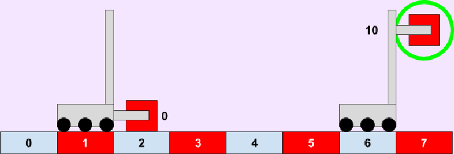

# General Programming Homework Assignments

On this document, you will find the assignments that go with each lecture, or lesson we give you. If a lesson has more than 1 problem, do each in a separate file.

### Lesson 1: Printing and Simple Arithmetic
Print out your name and age. Then, print out your age in months using multiplication.

### Lesson 2: Variables
Pizza Shop: Have the user input an order for pizza, then print out their order in one sentence. Have variables for their name, how many pizzas they want, how many pieces of pepperoni, and how many olives. Then print out their order with “(name) ordered (x) pizzas with (y) pepperonis and (z) olives.”
CHALLENGE- Get three number inputs from the user. Then, print out the average of the three user inputs. 
Tip: when assigning a variable to a number value, use the following:
    variable_name = int(raw_input(“Enter your first number: ”))

### Lesson 3: Types
Write a program to test the output of the following:
 * Are float(4.6) and int(4.6) the same? If not, how are they different?
 * What does int(3.7) return?
 * Does int(“4.5”) work? Does int(“4 and 5”)?
 * What happens when you try float(“three point six”)? Or float(“three”)?

### Lesson 4: Conditionals and Booleans
Input the user’s age. Then, tell them what they can and cannot do using the following criteria and if/elif/else statements:
 * 14+ can join robotics team
 * 16+ can drive and get a job
 * 18+ can attend college
 * 21+ is an adult
 * 35+ can become President

### Lesson 4.5: The Software Engineering Process
We have a list of patients with values of their weight and height. This program is supposed to return the BMI (Body Mass Index) for with patient in a loop. However, something is not quite right. Time to debug!!

    patients = [[70, 1.8], [80, 1.9], [150, 1.7]]
    def calculate_bmi(weight, height):
        return weight / (height ** 2)
    for patient in patients:
        weight, height = patients[0]
        bmi = calculate_bmi(height, weight)
    print "Patient's BMI is:" + str(bmi)

### Lesson 5: Lists
Make a list of 10 words. They can be any word you want. Then, have the user input a new word. If the word exists in the list, say so. If it doesn’t, add the word to the list. Afterwards, print out the list.
Make a list and store the user’s name, favorite color, and number of pets. Then print out the sentence “(Name)’s favorite color is (color). They have (x) pets.”

### Lesson 6: Loops
Make a program that takes user input and adds it to a list until the user inputs “stop”. “stop” should not be a part of the list. Then, print out the list.
Make a list. It can be any length and have anything in it. Now, make a new list that is the same list but reversed! 
Extra Challenge: Solve the first three problems from [project Euler](https://projecteuler.net/archives). Technically, people aren’t supposed to post solutions, but they do so anyways - Google can always help.

### Lesson 7: Functions
Change all your past homeworks (except Lesson 3) into functions. Any starting variables will become function parameters (eg. lesson 5 problem 1’s list of 10 words). You can either have all the functions in one file or go back to your old programs and make them into functions.
Make a function that tells you if some number is divisible by another number (there should be two parameters). Have it return a boolean, and then tell the user if the number is divisible. You may want to use this function for future assignments.

### Lesson 8: Classes
Make a class for a robot! This robot can only drive in a straight line on a field 7 meters long. The robot has a drive base and an arm that can move up and down. Imagine that the arm can pick up and score cubes for 5 points each. Your robot should have these variables:
 * Position
 * Arm position
 * Whether or not it has a piece
 * Score from scoring cubes
The robot class should also have methods to:
 * move
 * raise/lower arm
 * pick up a cube
 * score a cube

Rules:
The robot starts at position 0 with no cubes and the arm 0 inches off the ground.
A cube can only be picked up when:
 * The robot is at space 3 (aka 3 meters from starting position)
 * The arm is 0 meters off the ground
 * The robot does not already have a cube
The robot must be holding a cube 10 inches in the air at space 7 to score it.

Once you have this class created, make a way for the user to control the robot! Use loops and input. Every time the robot does something, make sure to print out information on its position, etc. so the user doesn’t get confused.

This is a pretty big assignment, so don’t be afraid to ask any questions!

### Lesson 9: Modules
Split your lesson 8 homework into 2 files. One file should have the whole robot class, and the other should create the robot object and control it with user input!
