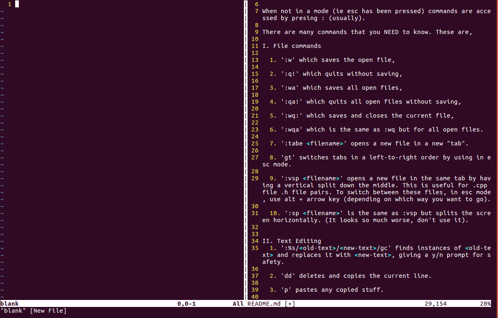
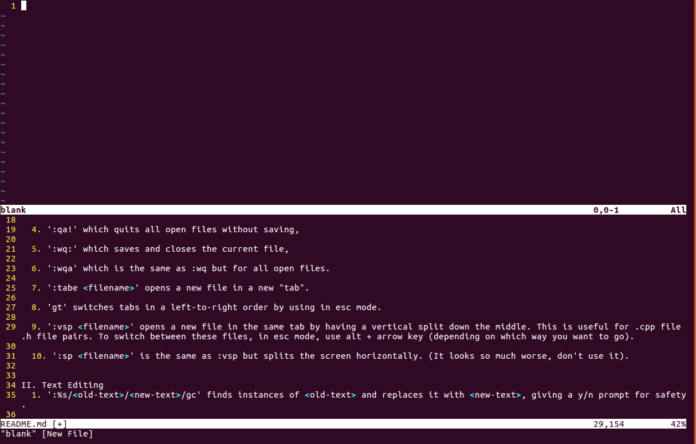

# Vim
##### Vim is a text editor that can be slightly hard to learn but has many useful shortcuts and is integrated with Terminal.

## File commands
* `vim <filename>` this opens <filename> in Vim. **NOTE:** this will create a new file if no such file exists. **NOTE**: this command requires a filepath.
* `:w` saves the open file,
* `:q!` quits without saving,
* `:wa` saves all open files,
* `:qa!` quits all open files without saving,
* `:wq:` saves and closes the current file,
* `:wqa` is the same as :wq but for all open files.
* `:tabe <filename>` opens <filename> in a new "tab".
* `gt` switches tabs in a left-to-right order by using in esc mode.
* `:vsp <filename>` opens a new file in the same tab by having a vertical split down the middle. This is useful for .cpp file .h file pairs. To switch between these files, in esc mode, use alt + arrow key (depending on which way you want to go). *Example:*
\
* `:sm is a text editor that can be slightly hard to learn but has many useful shortcuts and is integrated with Terminal.

## Text Editing
* `i` goes into insert mode, where you can insert text.
* `:%s/<old-text>/<new-text>/gc` finds instances of <old-text> and replaces it with <new-text>, giving a y/n prompt for safety.
* `dd` deletes and copies the current line.
* `p` pastes any copied stuff.
* `o` creates a new line with the same indentation as the old line.
* `Shift-o` is the same as `o` same but it creates the new line above the old one.

## Cursor Commands
* `Shift-g` goes to test bottom of the file.
* `e` goes to the next character that is before a space or a new line.
* `w` goes to the next character that is after a space or a new line.

## Visual Mode
* `v` goes into visual mode, highlighting characters, preparing them for other commands. **NOTE**: The highlighter starts from the character the cursor's on and is unidirectional. **NOTE**: The character the cursor is on counts as highlighted.
* `d` deletes the highlighted characters.
* `y` copies the highlighted characters, alowing them to be pasted elsewhere (including other files).
* `esc` switches from insert/visual mode to normal mode.p <filename>` is the same as :vsp but splits the screen horizontally. *Example:* 
\
(It looks so much worse, don't use it).

## Text Editing
* `i` goes into insert mode, where you can insert text.
* `:%s/<old-text>/<new-text>/gc` finds instances of <old-text> and replaces it with <new-text>, giving a y/n prompt for safety.
* `dd` deletes and copies the current line.
* `p` pastes any copied stuff.
* `o` creates a new line with the same indentation as the old line.
* `Shift-o` is the same as `o` same but it creates the new line above the old one.

## Cursor Commands
* `Shift-g` goes to test bottom of the file.
* `e` goes to the next character that is before a space or a new line.
* `w` goes to the next character that is after a space or a new line.

## Visual Mode
* `v` goes into visual mode, highlighting characters, preparing them for other commands. **NOTE**: The highlighter starts from the character the cursor's on and is unidirectional. **NOTE**: The character the cursor is on counts as highlighted.
* `d` deletes the highlighted characters.
* `y` copies the highlighted characters, alowing them to be pasted elsewhere (including other files).
* `esc` switches from insert/visual mode to normal mode.
